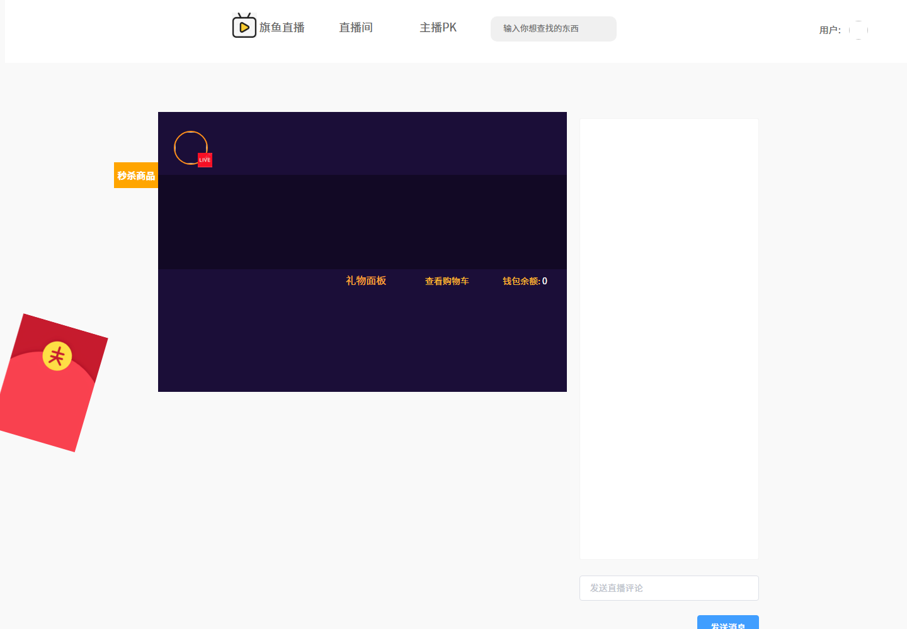
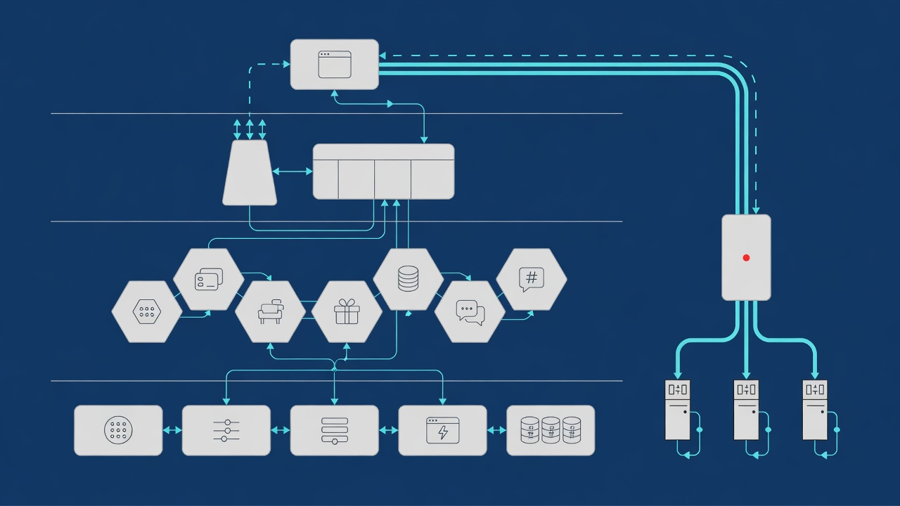
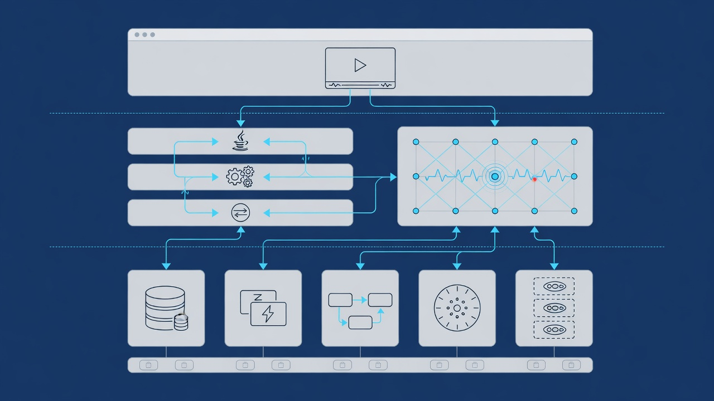
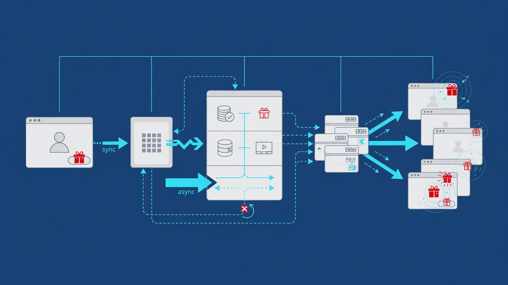
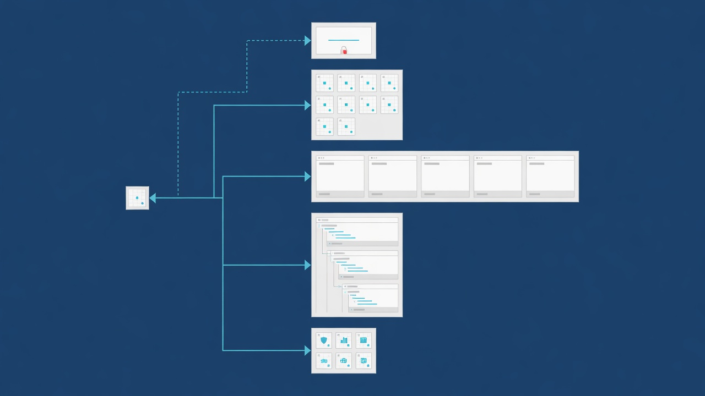

# Qiyu Live

> 一个用于拆解直播平台微服务、IM 与高并发业务设计的教学型项目。

[项目边界](#项目边界) · [业务能力](#业务能力) · [preview](#preview) · [快速开始](#快速开始) · [架构](#架构) · [学习路线](#学习路线)


## 项目边界

这个仓库保留了旗鱼直播课程的后端源码、静态前端和讲义。它适合做架构学习与代码分析，但目前不是开箱即用的生产系统。

| 组成 | 内容 | 当前判断 |
|---|---|---|
| `backend/` | Java 17 微服务后端 | 业务域较完整，配置和测试基线不足 |
| `web/` | Vue 2 + Element UI 静态多页前端 | 静态资源已补，播放与后端接线待完成 |
| `upstream-docs/` | DOCX/PDF 课程资料 | 只读参考，可能与最终代码不一致 |
| `docs/` | 当前维护的上下文、ADR 和分析 | Agent 与人工协作事实源 |
| `assets/` | 原始包、配图和演示素材 | 原始包默认不提交 |

## 为什么值得分析

直播系统把普通 Web 服务和实时系统放在同一条业务链路里。这个项目提供了几个具体切面：

- Gateway、BFF 与 Dubbo Provider 的服务分层。
- Redis Token、用户缓存和 IM 路由绑定。
- RocketMQ 驱动的送礼、在线状态与缓存失效。
- Netty TCP/WebSocket 长连接和定向消息路由。
- MySQL 分库分表、虚拟币账户、直播 PK、红包和带货。

代码也保留了教学项目常见的问题，包括硬编码环境、依赖版本过时、配置不一致和自动化测试缺失。这些问题本身就是分析材料。

## 业务能力


| 业务域 | 已有能力 | 主要边界 |
|---|---|---|
| 用户与登录 | 短信验证码、Cookie Token、用户标签 | User、Account、Message |
| 直播间 | 列表、开播、关播、在线状态 | Living |
| 实时互动 | 聊天、心跳、ACK、上线与下线 | IM Core、IM Router |
| 礼物 | 礼物配置、异步送礼、动画推送 | Gift、Bank、IM |
| 直播 PK | 双主播、PK 进度、PK 礼物 | Living、Gift、Web |
| 支付 | 旗鱼币账户、充值商品、支付订单 | Bank |
| 扩展业务 | 红包雨、直播带货 | Living、Web |

## Preview

### README 本地预览

```powershell
cd E:\douyu-pjt
python -m http.server 4173
```

打开 `http://127.0.0.1:4173/preview-readme.html`。该页面通过 HTTP 获取并渲染当前 README。

### Web 静态 Preview

后端现有 CORS 配置使用 `http://web.qiyu.live.com:5500`。先在本机 hosts 中映射：

```text
127.0.0.1 web.qiyu.live.com
```

然后启动：

```powershell
cd E:\douyu-pjt\web
python -m http.server 5500
```

打开 `http://web.qiyu.live.com:5500/html/living_room_list.html`。



这个 Preview 只能检查静态页面。Element UI 图标字体已恢复，现有本地图片引用完整；REST API 仍指向 `app.qiyu.live.com`，主直播播放接线和后端数据仍缺失，完整业务需要后端与中间件环境。

### Showcase

系统跑通后补充以下真实截图：

- 首页、登录和直播间列表
- 普通直播间、聊天和礼物
- PK 直播间与进度

截图契约见 `assets/images/readme/README.md`。

## 快速开始

### 阅读项目

1. 从 `CONTEXT.md` 与 `CONTEXT-MAP.md` 开始。
2. 阅读 `docs/agents/domain.md` 了解业务域。
3. 后端从 `backend/pom.xml`、`backend/nacos-config/` 和 `backend/sql/` 进入。
4. 前端从 `web/html/living_room_list.html` 和 `web/js/constants.js` 进入。
5. 深度分析范围见 `docs/output/prd/project-analysis/prd.md`。

### 后端运行前置

完整后端依赖 JDK 17、Maven、Nacos、MySQL 8、Redis、RocketMQ 和多个本地域名映射。不要直接使用课程配置连接真实环境。

建议先完成配置清点和最小服务子集设计，再启动全部 Provider。当前仓库还没有提供一条经过验证的一键启动链路。

## 架构



```text
Web
  -> Gateway
  -> API BFF
  -> Dubbo Interfaces
  -> User / Account / Living / Gift / Bank / Message / ID Providers

WebSocket
  -> IM Core Server
  <-> IM Router
  <-> Redis binding

Async events
  -> RocketMQ
  -> Gift / Living / User / IM consumers
```

### 技术栈



| 层 | 技术 |
|---|---|
| Web | Vue 2.6.10、Element UI、Axios、flv.js、SVGA |
| API | Spring Cloud Gateway、Spring Boot MVC |
| RPC | Dubbo 3.2.0-beta.3 |
| IM | Netty 4.1.x、TCP、WebSocket |
| Data | MySQL 8、MyBatis-Plus、ShardingSphere JDBC |
| Middleware | Nacos、Redis、RocketMQ |
| Delivery | Maven、Docker、Docker Compose |

### 主链路示例



送礼流程：

```text
Web POST /gift/send
  -> API 发布 RocketMQ 消息
  -> Gift Provider 消费
  -> Bank RPC 扣减旗鱼币
  -> Living RPC 查询房间用户
  -> IM Router 定位连接实例
  -> IM Core Server 推送 WebSocket 消息
  -> Web 播放礼物动画
```

## 仓库结构



```text
.
├── backend/
├── web/
├── upstream-docs/
├── docs/
│   ├── agents/
│   ├── adr/
│   ├── contexts/
│   ├── knowledge/
│   └── output/
├── assets/
├── AGENTS.md
├── CLAUDE.md
├── CONTEXT.md
└── CONTEXT-MAP.md
```

## 学习路线

1. 登录与网关鉴权。
2. Dubbo 服务边界和 BFF 聚合。
3. 直播间、礼物与虚拟币业务。
4. RocketMQ 异步链路与幂等。
5. Netty IM、Router 和在线状态。
6. 分库分表、缓存一致性与压测。
7. 配置治理、测试基线和现代化改造。

## 文档

- Agent 工作流: `docs/agents/workflow.md`
- 领域模型: `docs/agents/domain.md`
- Monorepo 决策: `docs/adr/0001-monorepo-boundaries.md`
- 上游资产清单: `docs/knowledge/upstream-assets.md`
- 分析 PRD: `docs/output/prd/project-analysis/prd.md`
- README 配图 brief: `docs/output/prd/readme-diagrams/readme-diagram-brief.md`

## 已知限制

- 后端配置使用教学环境域名和示例凭据，尚未完成统一。
- 根 POM、资源目录和 Dubbo 端口存在已知疑点。
- Web 端依赖过时，缺少构建链路与测试。
- 主直播间没有完整接入 flv.js 播放。
- 当前没有许可证文件，使用和分发前应确认上游授权。
